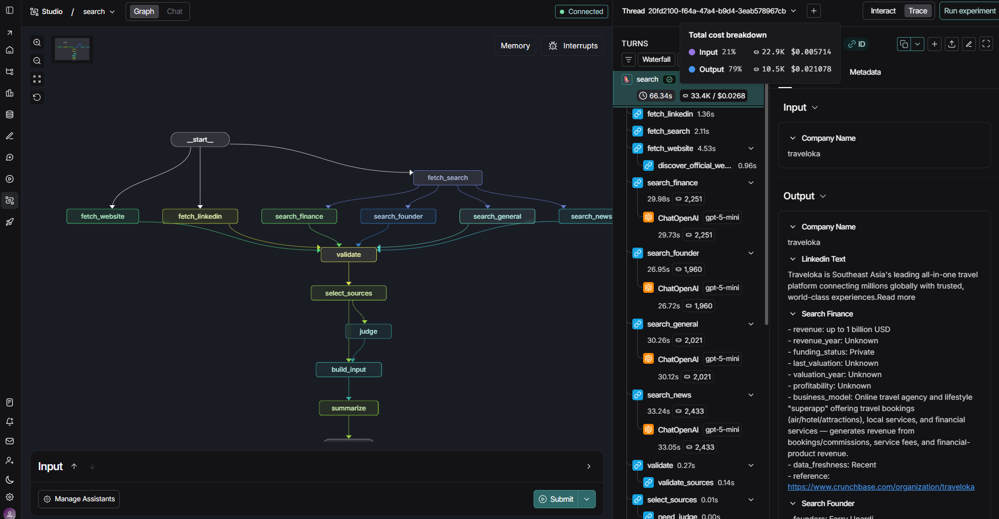

# bounded-agents

**Deterministic orchestration for LLM pipelines: authority in code, phrasing in the LLM.**

Most "agentic" pipelines let the LLM decide what's true. This kit doesn't: source
priority, what counts as a gap, and what's allowed to fill it are all decided in
code before the LLM ever sees the data. The LLM's job is synthesis and
judgment inside boundaries it can't step outside of — not deciding what to trust.

Two things live here:

- **`src/bounded/`** — a small, reusable kit. Define a typed `Capability` once,
  run it as a CLI command, a LangGraph node, or an MCP tool, without rewriting
  the logic three times. Also ships the arbitration/judge pattern above as
  generic, swappable pieces.
- **`examples/company_research/`** — the reference example: a LangGraph
  pipeline that researches a company from its website, LinkedIn, and search,
  then writes a summary to Google Sheets. It's what proves the kit isn't just
  an abstraction exercise.

See [`docs/DESIGN.md`](docs/DESIGN.md) for the design rationale, and
[`docs/PROGRESS.md`](docs/PROGRESS.md) for how this repo got here.


## Why "bounded"

An LLM judge in this pipeline can flag a gap and recommend which
already-approved secondary source should fill it. It cannot introduce a new
source, invent a fact, or merge conflicting claims — that's enforced by
`bounded.arbitration` and `bounded.judge`, not by prompting alone. If the
judge's output can't be parsed, the pipeline falls back to the deterministic
selection instead of guessing. Authority never depends on the LLM behaving.

## Quickstart

```bash
git clone https://github.com/bashatahamal/bounded-agents.git
cd bounded-agents
uv sync
cp .env.sample .env   # fill in your API keys — see below
uv run searchapp <spreadsheet_id>
```

`uv run searchapp --help` works with **no credentials set at all** — nothing
in this repo touches the network or reads settings until you actually invoke
a pipeline.

### Prerequisites

- Python ≥ 3.12
- [`uv`](https://github.com/astral-sh/uv)
- OpenAI API key, Tavily API key, Serper API key
- A Google Sheets service account (only needed for the Sheets sink — see
  [Sinks](#sinks-swap-the-output) below for alternatives that need none of
  this)

## The kit (`src/bounded/`)

| Module | What it is |
| --- | --- |
| `capability.py` | `Capability[TIn: BaseModel, TOut: BaseModel]` — one typed input, one typed output, one `run` callable. Register once, run three ways. |
| `registry.py` | Name → `Capability` lookup. |
| `adapters/cli.py` | Turns a Capability's input model into an argparse subcommand automatically. |
| `adapters/langgraph.py` | Wraps a Capability as a dict-in/dict-out LangGraph node. Also has `safe_merge`, a generic None-safe/type-aware state-merge reducer for parallel graph branches. |
| `adapters/mcp.py` | Describes a Capability as an MCP tool (name, description, JSON schemas, handler) — no MCP SDK dependency required. |
| `arbitration.py` | `Source` + `select()` — deterministic primary/secondary source selection, given sources in priority order and a `field -> keywords` coverage map. |
| `judge.py` | `parse_judge_output()` / `run_bounded_judge()` — defensively parses an LLM judge's raw text (strips code fences, smart quotes, trailing commas) and drops any field the judge invented outside the allowed schema. Raises `JudgeError` rather than ever fabricating a result. |
| `sinks/` | `Sink` protocol + `GoogleSheetsSink`, `CsvSink`, `JsonlSink`. Swap the output target without touching pipeline logic. |
| `llm/` | `LLMProvider` protocol + `OpenAIProvider`. |
| `credentials.py` | Loads a JSON credential from a file path, base64, or raw JSON string — fails loudly instead of ever silently returning `{}`. |
| `resilience.py` | `with_retry()` — a thin `tenacity` wrapper for exponential-backoff retries on flaky network/LLM calls. |
| `observability.py` | structlog config + opt-in LangSmith tracing (only activates if `LANGSMITH_API_KEY`/`LANGCHAIN_API_KEY` is set). |

None of this is company-research-specific. A different pipeline (incident
triage, product research, anything that needs "pick an authoritative source,
optionally ask an LLM to fill gaps under supervision") can depend on
`bounded` directly and bring its own example.

## The example (`examples/company_research/`)

Website, LinkedIn, and four search facets (general / founder / finance /
news) fetch in parallel and fan into `validate` → `select_sources`, which
picks one primary source and ranks the rest as secondary (see the graph
diagram above). `select_sources` conditionally routes to `judge` — only when
there's a coverage gap *and* a secondary source that could plausibly fill it
— before `build_input` → `summarize` produces the final write.

- **Sources are fetched in parallel**; authority is applied only at
  selection time (website > search > LinkedIn, in code — see
  `nodes/validate.py`).
- **The judge is invoked conditionally** — only when there's a gap *and* a
  secondary source that could plausibly fill it. If nothing needs enriching,
  the LLM never sees the judge prompt at all.
- **Everything degrades gracefully**: a failed fetch, an unparsable judge
  response, a missing field — none of it crashes the run. The pipeline
  either narrows what it claims or explicitly marks a gap; it never guesses
  silently.

Full rationale: [`docs/DESIGN.md`](docs/DESIGN.md).

### Running it

```bash
uv run searchapp <spreadsheet_id>
uv run searchapp <spreadsheet_id> --input-worksheet Names --output-worksheet "Review Company"
```

**Input sheet** — one column, `Company Name`:

| Company Name |
| --- |
| Traveloka |
| Gojek |

**Output sheet** — written to `Review Company` by default:

| Company | Summary |
| --- | --- |
| Traveloka | **Company Overview**: Traveloka is ... |
| Gojek | **Company Overview**: Gojek is ... |

### Sinks: swap the output

`CompanyResearch` currently wires up `GoogleSheetsSink`, but the graph itself
returns a plain `dict` — swapping in `CsvSink` or `JsonlSink` (no Google
credentials needed) means changing one constructor call, not the pipeline:

```python
from bounded.sinks import CsvSink

sink = CsvSink("out/")
sink.write(["Company", "Summary"], [[name, summary]], destination="companies")
```

## Observability: LangGraph Studio + LangSmith (optional)

```bash
cp .env.sample .env   # set LANGSMITH_API_KEY / LANGCHAIN_API_KEY too
docker compose up --build
```

Then open LangGraph Studio:

```
https://smith.langchain.com/studio/?baseUrl=http://0.0.0.0:1024
```



Traces are node-level: fetch inputs, judge prompts/responses, token usage per
step. None of it is required to run the pipeline — see
`bounded.observability.maybe_wrap_openai`.

## Development

```bash
uv sync --extra dev
uv run pytest -q                          # 62 tests: kit unit tests, fixture-based
                                           # fetcher tests, a mocked end-to-end run
uv run ruff check src examples tests
uv run ruff format src examples tests
uv run mypy src examples
```

`.pre-commit-config.yaml` runs ruff automatically on commit:

```bash
uv run pre-commit install
```

CI (`.github/workflows/ci.yml`) runs the same checks on Python 3.12 and 3.13.

## License

[Apache-2.0](LICENSE).
