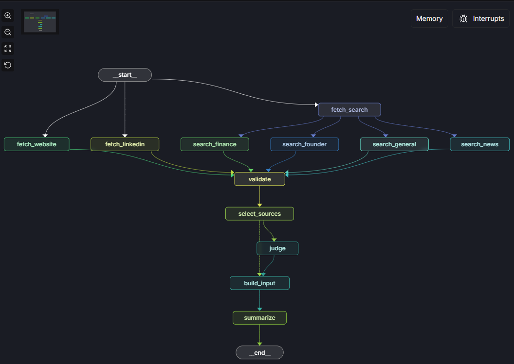
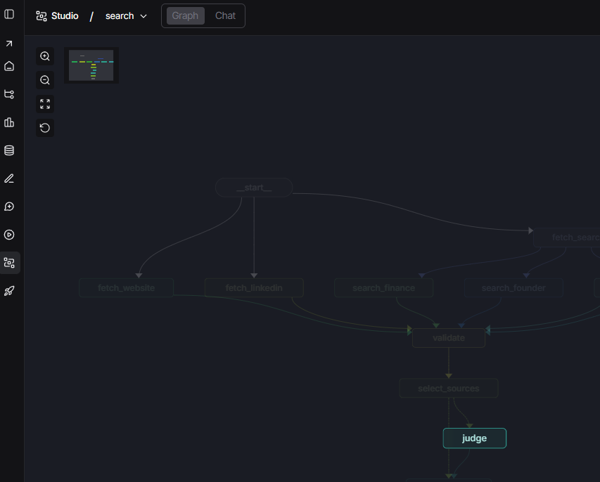
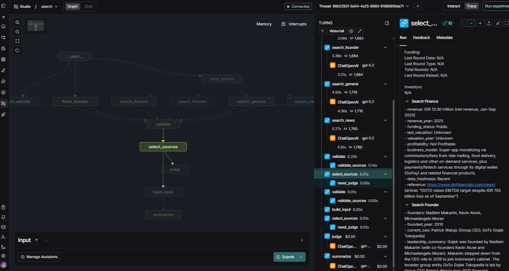
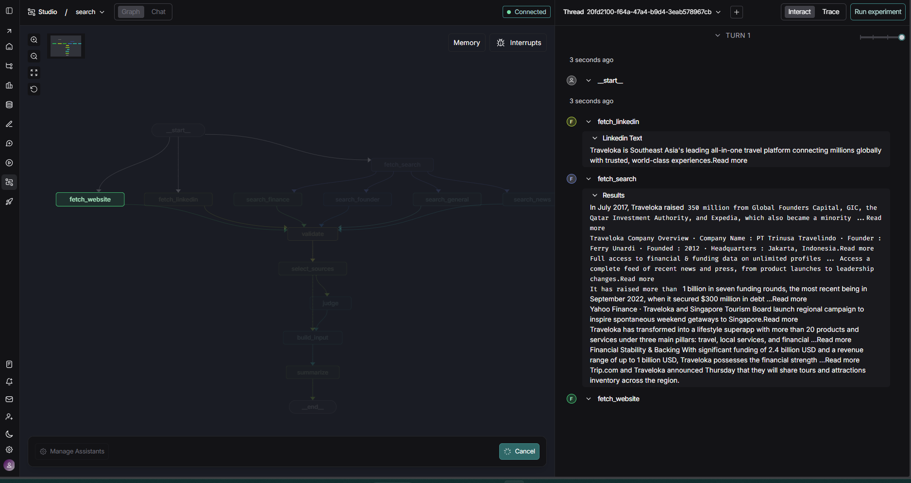
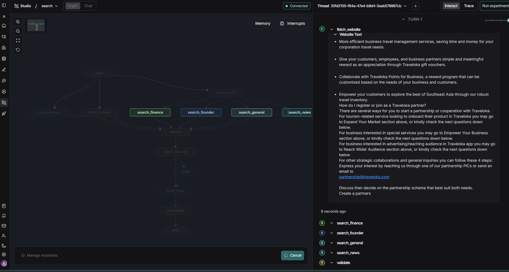
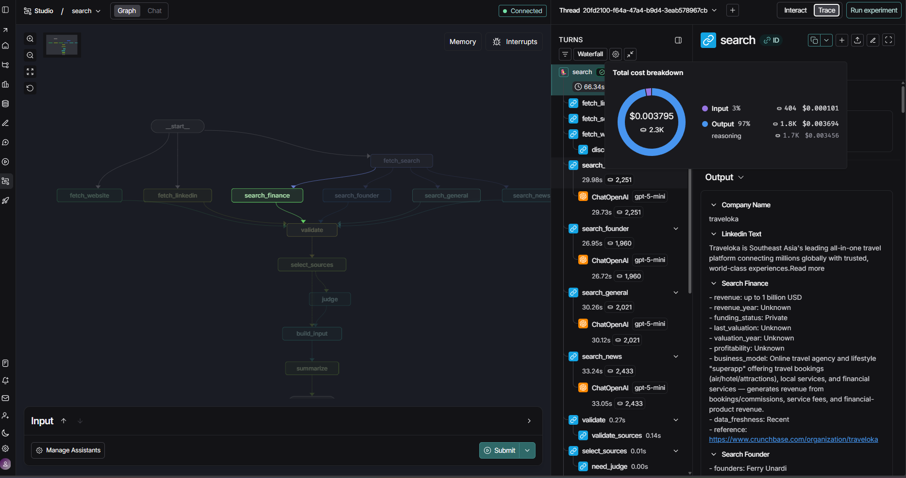
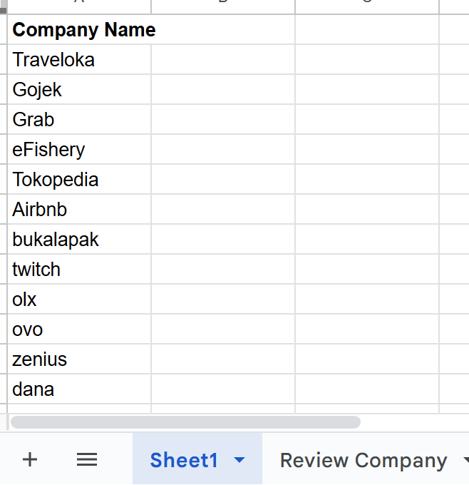
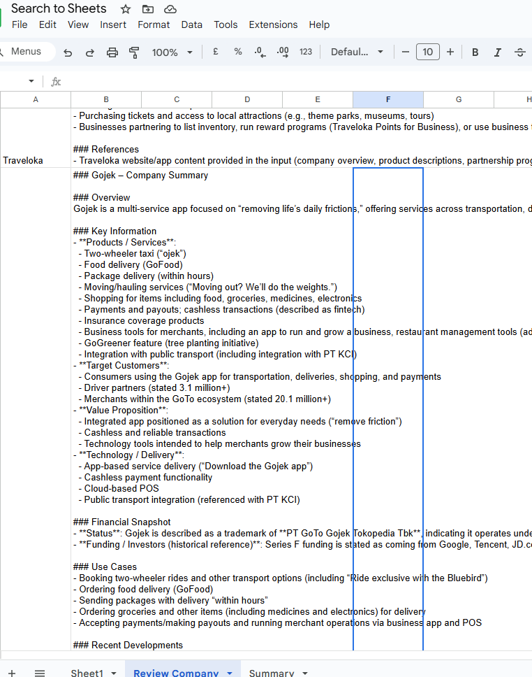
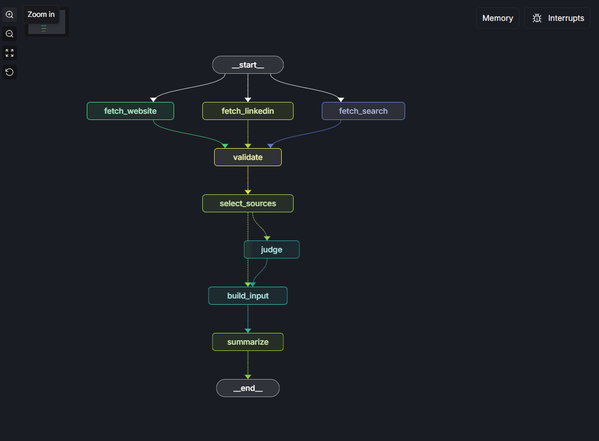
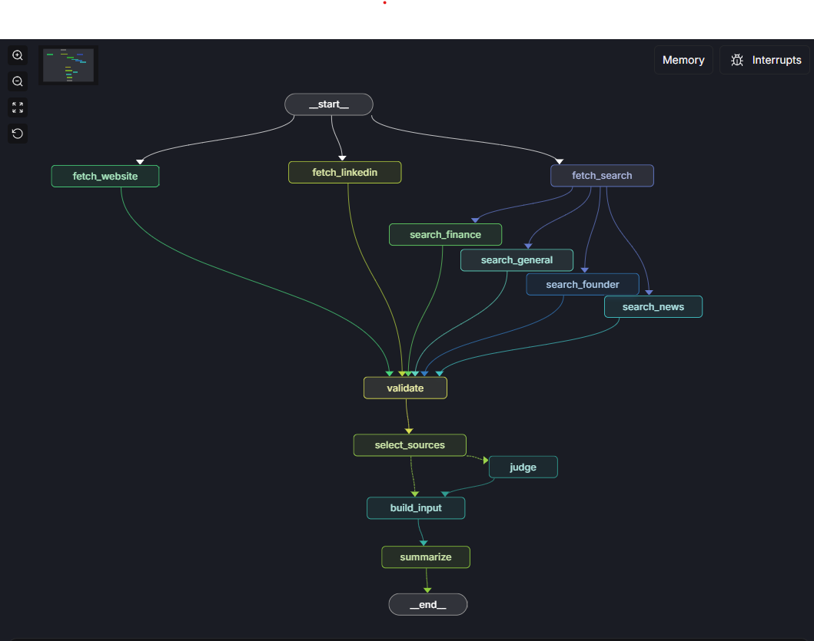

# Development Approach

This project is designed as a **deterministic, auditable, and debuggable research pipeline** for transforming heterogeneous public company data into structured summaries suitable for downstream consumption (Google Sheets).

The primary design goal is **control under uncertainty**. Public company information is often incomplete, biased, or conflicting. As a result, the system is engineered to make uncertainty explicit, preserve source authority, and avoid delegating trust decisions entirely to an LLM—while still leveraging the LLM’s strength in understanding and generating natural language.

---

## 1. Workflow Orchestration with LangGraph

LangGraph is used strictly as a **deterministic workflow engine**, not as a fully autonomous agent.

The workflow is modeled as a **procedural state machine**:

* Nodes have explicit, single responsibilities
* Transitions are deterministic and code-controlled
* The LLM does not decide control flow or authority

This design enables:

* Explicit state tracking across fetch, validation, selection, judging, and summarization
* Clear step boundaries (Fetch → Validate → Select → Judge → Summarize)
* Fine-grained observability via LangSmith during development
* Safe future extensibility (e.g., adding new sources, retries, or evaluation hooks)

LangGraph is used deliberately in this procedural mode. The distinction between **procedural** and **unprocedural (autonomous)** behavior is intentional: when the task is well-defined and step-based, additional agentic complexity is unnecessary and can reduce debuggability and predictability.

---

## 2. Source Acquisition Strategy

Company knowledge is gathered from multiple public sources, each assigned an explicit priority based on reliability and practical constraints.

* **Official website**: treated as the primary authoritative source when available
* **LinkedIn**: accessed only via search-engine snippets
* **Search (Tavily / Serper)**: used as a fallback or enrichment layer

LinkedIn data is obtained only through search-engine snippets to avoid direct scraping and ensure compliance.

Search is used as a **robust fallback**, including domain-filtered queries (e.g. `site:company.com`) when crawling is unreliable, blocked, or incomplete.

The choice of Tavily or Serper is not fundamental to the design. The key consideration is that search providers can be **plugged into the LangGraph node structure** with minimal changes, preserving continuity and traceability.

### Parallel Fetching vs. Deterministic Arbitration

All sources are fetched **in parallel** to maximize coverage and reduce latency. However, sources are **not treated equally**.

* Parallelism addresses speed and availability
* Deterministic arbitration addresses correctness and debuggability

All sources are fetched in parallel to maximize coverage; **source prioritization is applied only during synthesis** to ensure authoritative data dominates the final summary.

Treating all sources equally would increase hallucination risk and obscure responsibility when errors occur.

### Source Selection and Fallback Logic (Code-Controlled)

The system selects:

* One **primary authoritative source** per company
* Optional **secondary sources** for controlled enrichment

Selection rules are deterministic and transparent:

1. Website (if valid)
2. LinkedIn snippet (if valid)
3. Search summary (fallback)

This ensures:

* Predictable behavior
* Clear traceability
* No silent blending of conflicting claims

Authority and fallback logic are enforced in code rather than implied through prompting.

---

## 3. LLM Role (Strictly Bounded)

The LLM is used as synthesis engine, never for browsing, discovery, or the only trust decisions.

### Bounded Judge Node (Optional, Controlled)

A bounded LLM “judge” node is optionally invoked only when:

* A primary source exists
* Secondary sources are available
* The primary source is incomplete or vague

The judge node:

* Identifies missing fields
* Flags bias or vagueness
* Recommends controlled enrichment

It explicitly cannot:

* Introduce new sources
* Override authority rules
* Merge conflicting facts
* Invent information

If the judge fails or returns incomplete output, the pipeline continues safely using deterministic fallback logic.

Authority remains in code; language synthesis is delegated to the LLM.

---

### Hybrid Merge Strategy

Rather than fully trusting the LLM or enforcing rigid single-source output, the system applies a hybrid merge strategy:

* Code determines **which sources may contribute**
* The LLM determines **how approved content is phrased**

Secondary sources are included only when the primary source lacks coverage. Missing or conflicting information is surfaced explicitly rather than smoothed over.

This approach mirrors practices from data engineering, journalism, and compliance-oriented systems.

---

## 4. Observability and Iteration (LangSmith)

During development, LangSmith is used for observability 
* Node-level tracing
* Prompt and response inspection
* Monitoring token usage per step
* Debugging incomplete, biased, or unexpected outputs

This makes it possible to trace how intermediate decisions and inputs influence the final summary.

---

## 5. Technology Choices: LangGraph + LangSmith Together

LangGraph and LangSmith are used together to support **continuity during development**.

**LangGraph (Structural Continuity)** provides:

* A persistent, explicit workflow representation
* Stable node boundaries as logic evolves
* Clear separation between acquisition, arbitration, and synthesis

This makes it easier to:

* Add new source or enrichment nodes
* Insert validation or evaluation steps
* Evolve the pipeline without rewriting control flow

**LangSmith (Observational Continuity)** provides:

* Historical traces across iterations
* Visibility into behavioral changes over time
* The ability to re-run and compare executions

Together, they support incremental development without losing context or traceability.

---

## 6. Design for Continuity and Extensibility

The system is intentionally composed of **separate, single-responsibility nodes** rather than a monolithic or prompt-heavy pipeline.

This separation is motivated by **continuity of development**, not premature optimization.

Each node:

* Performs one scoped task
* Produces explicit, inspectable outputs
* Can be replaced independently

This enables:

* Safer incremental changes
* Easier experimentation
* Reduced blast radius when modifying behavior

For example:

* A fetch node can switch from crawling to an API source
* A judge node can be refined or disabled independently
* Summarization prompts can evolve without altering arbitration logic

---

## 7. Possible Improvements and Future Continuity

The current design intentionally stops short of additional complexity, but leaves room for incremental improvement, including:

* Deeper or more refined search strategies
* Smarter query generation
* Additional source nodes (e.g. filings, blogs, news)
* Lightweight evaluation or scoring nodes
* Judge prompt or heuristic refinement
* Cost and latency monitoring using existing trace data

Because authority, control flow, and fallback logic are already explicit, these improvements can be introduced incrementally rather than through large refactors.

---

### link to google sheet 
[List Spreadsheet](https://docs.google.com/spreadsheets/d/1aA6b3Jzx4wH-EgGb29RLMOs-G1gOvlpXgwQSBMoitLM/edit?gid=415867252#gid=415867252)

### sample of langsmith trace
[Sample Trace](https://smith.langchain.com/public/f5b7e8e1-1edb-415a-a770-7a65622f37e6/r)

[Sample Trace](https://smith.langchain.com/public/2761e900-abf9-489e-bb31-b9aac26135e7/r)

## last trial node design

